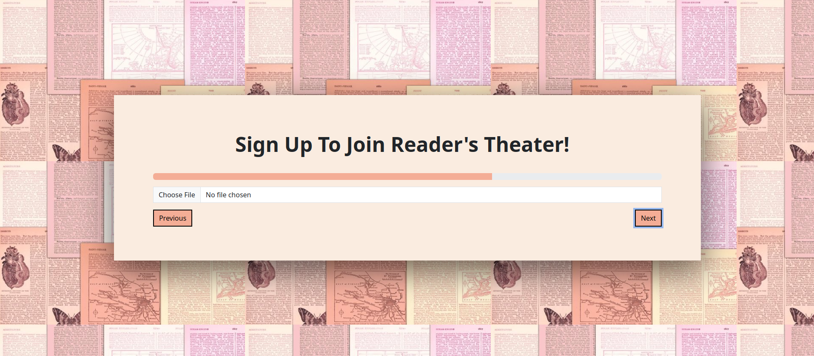
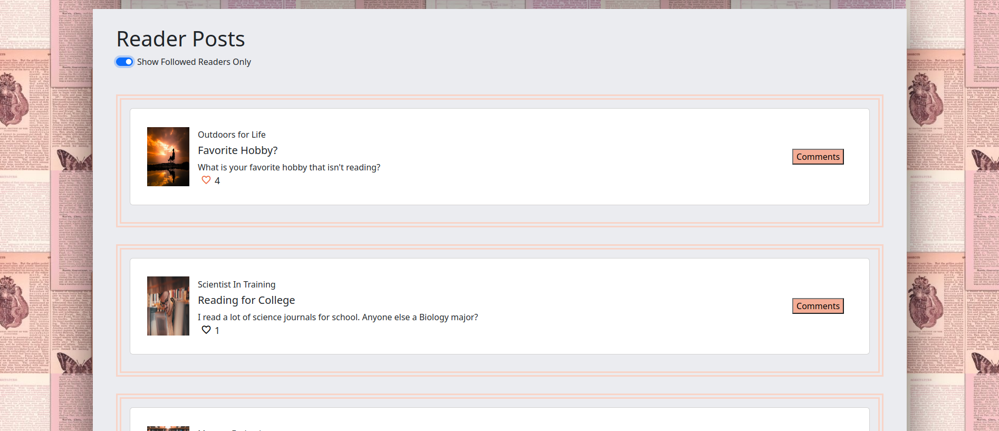

<a name="readme-top"></a>

<br />
<div align="center">
   
  </a>

<h3 align="center">Reader's Theater Social Media Site</h3>

  <p align="center">
    Full Stack MERN (MongoDB, Express, React, and Node) Project
    <br />
<!--     <a href="https://readers-theater.netlify.app/">View Demo</a>
    · -->
    <a href="https://github.com/Amiriel01/Readers-Theater/issues">Report Bug</a>
    ·
    <a href="https://github.com/Amiriel01/Readers-Theater/issues">Request Feature</a>
  </p>
</div>

<details>
  <summary>Table of Contents</summary>
  <ol>
    <li>
      <a href="#about-the-project">About The Project</a>
      <ul>
        <li><a href="#website-images-and-descriptions">Website Images and Descriptions</a></li>
      </ul>
      <ul>
        <li><a href="#built-with">Built With</a></li>
      </ul>
    </li>
    <li>
      <a href="#getting-started">Getting Started</a>
      <ul>
        <li><a href="#installation">Installation</a></li>
      </ul>
    </li>
    <li><a href="#contributing">Contributing</a></li>
    <li><a href="#acknowledgments">Acknowledgments</a></li>
  </ol>
</details>

## About The Project

I wanted to create a social media site that catered to readers. I've not run across a social media site that served just the reading enthusiasts of the world and thought it would be a unique spin on a social media site. Below you will see several images and descriptions, you can also view the live demo by clicking the link above in the header also. 

This full stack social media site was created using TypeScript, React, Vite, Node.js, Express, Mongoose, and MongoDB. I used Passport and Bcrypt for password authentication. Bootstrap was used in some of the styling and Multer was used for image uploads. The website is fully mobile and tablet responsive also. 

If you notice any bugs or have an idea to make this website even better please use the links above to make your suggestions! Thank you in advance for viewing my website. 

### Website Images and Descriptions

**Start Page**

The start page gives the title and one sentence about the purpose of the website. Visitors are able to choose Login if they've already created an account and Sign Up if they do not already have an account. The only pages of the website that are available to viewers that are not logged in to an account are the start, login, and sign up pages.


**Login Page**

The login page has two inputs, username and password. Passwords are protected using Passport and Bcrypt. The password input also has a button that toggles viewing the password on and off. The user is able to return to the start page or login after they've entered their credentials. 


**Sign Up Page**

The sign up page has a three stepper form. In the first step the user creates their username and password. The frontend also checks the passwords match before the form is submitted. The user will recieve an error if the passwords do not match. Once finished with step one, the user clicks next. On the second page, the user will select their profile image. Upon choosing the file and navigating to the next page the image is sent to the backend file via Multer. The image string location is saved in the database. After the profile image is selected, the user will move to step three. In step three the user will enter their profile name, this name is the one visible to others, and their about me information. Once the user has created their account they are routed to the login page to enter their credintials and gain access to the website.





**User Profile Page (Delete User Disabled on Demo Site)**

After the user has successfully logged into their account they are routed to their user profile page. The profile page showcases the information given in the sign up form first. The user profile section also has the options to update and delete the user's profile. If the profile is deleted the user's comments and posts will also be deleted as well. The rest of the user profile page holds the followed readers and posts section. The user can click the followed readers to link to their profile page, make posts, like their posts, comment on their posts, and read other reader's comments about the post on this page. The user can edit, delete, read, and create posts and their own comments on this page. Readers only have access to their posts on their profile page.


**Update Profile Page**

The user is able to update their profile image, profile name, and about me sections by clicking the Update Profile link on the User Profile Page. 


**Header**

The site header is seen on every page except the start, login, and sign up pages. The header has two features. The first is a search bar that helps the user navigate to other reader's pages. The search bar autofills with suggested readers based on the letters typed. The other feature is a dropdown menu that routes to other pages in the website. The options for routing from the dropdown are My Profile, Newsfeed, All Readers, and Logout.


**Newsfeed**

On the newsfeed page the logged in reader can make new posts, just like they could on their profile page. The reader can also see posts made by all readers that are members of the site or only their followed readers. The posts populate with the newest at the top of the list when rendered. The reader can like posts, comment on posts, view comments by others on the posts, and edit/delete their own posts from the newsfeed page. Readers are only allowed to edit and delete posts/comments they've created. The like heart will show red to the user if they've personally liked the post or black if they have not. Users will see the total count for likes on each post. When the user clicks comments they will see the form to create a comment for the post and be able to read all other comments previously left on the post.





**All Readers**

The all readers page is a place where the logged in user can view all users on the platform. The users are sorted into two categories, Suggested Readers and Readers You Follow. The user can visit the other readers' profile pages by clicking the link to their page. This page is intended to be an easy place to follow or unfollow other readers.


**Viewed Profile Pages (non-logged in user)**

When the logged in user visits another readers profile page the layout is basically the same. Instead of seeing the Update Profile and Delete Profile options they will now see a Follow or Unfollow in the same location. The user is able to click the follow/unfollow link to complete the action. The user will be able to see that reader's friends and posts. The user is able to like, make a comment, and read the other comments on the posts on the viewed reader's profile page.


**Logout**

Logout uses passport to logout the logged in user. Once logged out the individual viewing the site will be routed back to the start page. The only options available are Login or Sign Up just like when they first arrived on the website.

<p align="right">(<a href="#readme-top">back to top</a>)</p>

### Built With

* [![Node][Node.js]][Node-url]
* [![React][React.js]][React-url]
* 
* [![React-Router][React-Router.com]][React-Router-url]
* [![Vite][vite.js]][Vite-url]
* [![Bootstrap][Bootstrap.com]][Bootstrap-url]
* 
* [![TypeScript][TypeScript.com]][TypeScript-url]
* [![Express][Express.js]][Express-url]
* [![MongoDB][MongoDB.com]][MongoDB-url]
* [![Nodemon][Nodemon.io]][Nodemon-url]
* [![NPM][NPM.io]][NPM-url]
* [![VSCode][VSCode.com]][VSCode-url]

<p align="right">(<a href="#readme-top">back to top</a>)</p>

## Getting Started

To get a local copy up and running follow these simple example steps.

### Installation

1. Clone the repo
   ```sh
   git clone https://github.com/Amiriel01/Readers-Theater
   ```
2. Install NPM packages
   ```sh
   npm install
   ```
3. Connect you MongoDB database `app.ts`
  
<p align="right">(<a href="#readme-top">back to top</a>)</p>

## Contributing

Contributions are what make the open source community such an amazing place to learn, inspire, and create. Any contributions you make are **greatly appreciated**.

If you have a suggestion that would make this better, please fork the repo and create a pull request. You can also simply open an issue with the tag "enhancement".
Don't forget to give the project a star! Thanks again!

1. Fork the Project
2. Create your Feature Branch (`git checkout -b feature/AmazingFeature`)
3. Commit your Changes (`git commit -m 'Add some AmazingFeature'`)
4. Push to the Branch (`git push origin feature/AmazingFeature`)
5. Open a Pull Request

<p align="right">(<a href="#readme-top">back to top</a>)</p>

## Acknowledgments

* [Pexels: Website Images](https://www.pexels.com/)
* [App Logo: Tab Logo](app.logo.com)
* [Google Fonts-Icons: Like Icon](https://fonts.google.com/icons)


[Node.js]: https://img.shields.io/badge/node.js-6DA55F?style=for-the-badge&logo=node.js&logoColor=white
[Node-url]: https://nodejs.org/en
[React.js]: https://img.shields.io/badge/React-%2320232a?style=for-the-badge&logo=react&logoColor=%2361DAFB
[React-url]: https://reactjs.org/
[React-Router.com]: https://img.shields.io/badge/React_Router-CA4245?style=for-the-badge&logo=react-router&logoColor=white
[React-Router-url]: https://reactrouter.com/en/main
[Vite.js]: https://img.shields.io/badge/vite-%23646CFF.svg?style=for-the-badge&logo=vite&logoColor=white
[Vite-url]: https://vitejs.dev/
[Bootstrap.com]: https://img.shields.io/badge/Bootstrap-%238511FA?style=for-the-badge&logo=bootstrap&logoColor=white
[Bootstrap-url]: https://getbootstrap.com
[TypeScript.com]: https://img.shields.io/badge/typescript-%23007ACC.svg?style=for-the-badge&logo=typescript&logoColor=white
[TypeScript-url]: https://www.typescriptlang.org/
[Express.js]: https://img.shields.io/badge/express.js-%23404d59.svg?style=for-the-badge&logo=express&logoColor=%2361DAFB
[Express-url]: https://expressjs.com/
[MongoDB.com]: https://img.shields.io/badge/MongoDB-%234ea94b.svg?style=for-the-badge&logo=mongodb&logoColor=white
[MongoDB-url]: https://www.mongodb.com/
[Nodemon.io]: https://img.shields.io/badge/NODEMON-%23323330.svg?style=for-the-badge&logo=nodemon&logoColor=%BBDEAD
[Nodemon-url]: https://nodemon.io/
[NPM.io]: https://img.shields.io/badge/NPM-%23CB3837.svg?style=for-the-badge&logo=npm&logoColor=white
[NPM-url]: https://www.npmjs.com/
[VSCode.com]: https://img.shields.io/badge/Visual%20Studio-5C2D91.svg?style=for-the-badge&logo=visual-studio&logoColor=white
[VSCode-url]: https://code.visualstudio.com/
